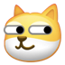
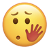
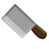

# WeChat Stickers Codes for Programmers

> update on 240423
>
> WeChat Android Version 8.0.48
> 
> stickers count: 13x8+5=109

## Usage

In the input text field in WeChat, type `[<sticker code>]` (eg. `[Facepalm]`) with keyboard to use these stickers more quickly than choosing them from visual list with cursor.

## Codes

||||||||||
|:-:|:-:|:-:|:-:|:-:|:-:|:-:|:-:|:-:|
|sticker|||||||||
|code|Smile|Grimace|Drool|Scowl|CoolGuy|Sob|Shy|Silent|
|sticker|||||||||
|code|Sleep|Cry|Awkward|Angry|Tongue|Grin|Surprise|Frown|
|sticker|||||||||
|code|Blush|Scream|Puke|Chuckle|Joyful|Slight|Smug|Drowsy|
|sticker|||||||||
|code|Panic|Laugh|Commando|Scold|Shocked|Shhh|Dizzy|Toasted|
|sticker|||||||||
|code|Skull|Hammer|Bye|Speechless|NosePick|Clap|Trick|Bah！R|
|sticker|||||||||
|code|Pooh-pooh|Shrunken|TearingUp|Sly|Kiss|Whimper|Happy|Sick|
|sticker|||||||||
|code|Flushed|Lol|Terror|Let Down|Duh|Hey|Facepalm|Smirk|
|sticker|||||||||
|code|Smart|Concerned|Yeah!|Onlooker|GoForIt|Sweats|OMG|Emm|
|sticker|||||||||
|code|Respect|Doge|NoProb|MyBad|Wow|Boring|Awesome|LetMeSee|
|sticker|||||||||
|code|Sigh|Hurt|Broken|Lips|Heart|BrokenHeart|Hug|ThumbsUp|
|sticker|||||||||
|code|ThumbsDown|Shake|Peace|Salute|Beckon|Fist|OK|Worship|
|sticker|||||||||
|code|Beer|Coffee|Cake|Rose|Wilt|Cleaver|Bomb|Poop|
|sticker|||||||||
|code|Moon|Sun|Party|Gift|Packet|Rich|Blessing|Fireworks|
|sticker||||||
|code|Firecracker|Pig|Waddle|Tremble|Twirl|

## Quick Check

- On Android, long press one sticker to check its code.
- On macOS, right click to copy stickers in messages to Notes.app to check their codes.

## Notice

The copyright of all stickers belongs to Tencent.
